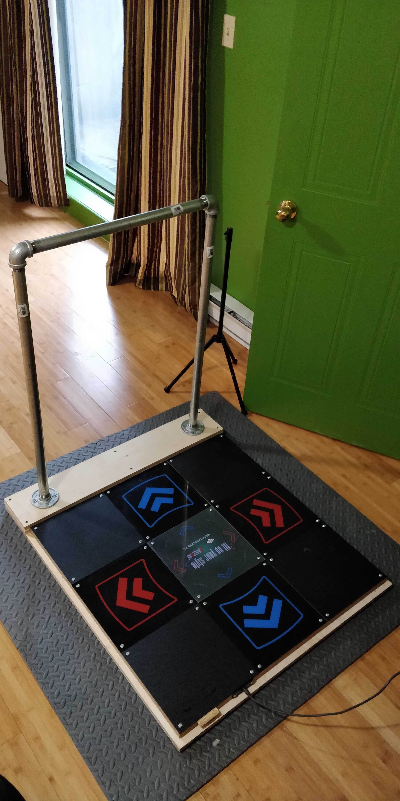

# Building a bar for my L-Tek pad

Here's what it looks like...

{:width="50%"}

...and here's how to build it.

(Well, that's a placeholder from when I only had one layer for both the base and back of the pad, but it'll have to do until I take a nice picture of the two-layer version.)

## Backstory

AKA you can skip [to the next section](#materials) if you're just here for the instructions. ;)

While I had been playing no-bar for 15 years before I built on, I was playing on soft pads so there was a relatively low ceiling I could reach anyway. When I got my L-Tek pad in December 2019 and started to get into ITG Stamina, I decided to break through that ceiling and get myself a bar _somehow_.

The options were few:
- Using a chair/table
	- I tried this, but I couldn't find a chair or table that was both sturdy enough to take the weight, and heavy enough not to move while I was using it.
	- My kitchen counter _did_ work, but that was a tad inconvenient. =P
- [The official L-Tek bar](https://www.maty-taneczne.pl/shop/dance-mat-ex-pro-the-handbar/)
	- It's pretty expensive, especially once you factor in shipping.
	- A friend in the local community had one and wasn't really satisfied with it, saying it didn't feel sturdy.
- Building my own
	- I wasn't sure if I'd be able to pull this off since I hadn't really done any woodworking before.
	- Seeing yutsi's bar on Stamina Nation's Discord conviced me to try, and I managed to do it!

## Materials

* ¾" plywood
  * 34" by 40" x 2 for the base
    * You can also only use one, but I've found that having two of them lessens the risk of the plywood warping over time.
  * 34" by 6" x 2 for the bar support
* 1½" diameter threaded pipe
  * 36" long x 2 for the vertical bars
  * 24" long for the crossbar  
  I know some people who went with custom pipe lengths, which allowed them to have a bar that's exactly the size they wanted. However, the cheapest way to get custom pipes is to cut them, they didn't have any threads to work with and so they had to weld/glue the bar together. It worked, but I don't know what it entails so I'm going to go with threaded parts here. ^^
* 1½" diameter threaded elbow x 2
* 1½" diameter threaded flange x 2
* 2½" long screws to fasten the flange to the plywood. My flanges had 4 holes each, so I needed 8 in total
* A whole bunch of 1¼" long screws to secure the pieces of plywood together
* Wood glue of some sort
  * I've heard there's a thing called green glue that also dampens sound and/or vibrations, but I have no experience using it.

### Tooling

* Just a drill works well, with assorted drill bits and screwing bits.

### Some notes about plywood

Not all plywood is equal. I don't know the specifics, but I do know that _it should be straight_. Don't do what I did and buy the first sheet you find, it's a good idea to at least make sure that it's as straight as it can be. Warped plywood is _pretty damn hard_ to straighten.

Also, make sure you store your plywood horizontally. I put mine up against a wall overnight after managing to get it straight-ish... and I had to do it all over again the next day. 😅

## Let's do it

### The Base
1. Make sure you can align them correctly
2. Apply some wood glue all around
3. Press them together!
4. Double-check that they're aligned right
5. Put 1¼" screws in the corners to hold it together
6. _Triple-check_ that the plywood pieces are aligned, because this is your last chance =P
7. Add in some more 1¼" screws at 6" or so intervals to press the two pieces together and make sure they'll stay that way once the glue dries

### Raising the Bar
1. Using the same method (and abundance of double-checking) as the previous step, fasten the two smaller plywood parts on one end of the base
2. Again 1¼" screws help a lot, but make sure you leave some empty, screw-free space where the base of the bar will be - we'll be drilling some rather long holes in there, and drilling into a screw isn't exactly fun

### Putting the Bar together
1. While everything starts to dry, assemble the bar from the various pipes
2. Tightly screw in the pipes into the elbows and flanges - you really don't want the crossbar to rotate while you play, so go for it and tighten it hard

### Let the glue dry for a day or so
1. It's better not to put the bar right away, just in case it leans forward or backwards and crooks the base as it's drying.

### The Final Touch
1. Place the assembled bar on top of the raised part on the back of the pad
2. Hold it in place somehow, once you start drilling you really don't want this to move. Otherwise you'll end up with mismatched holes, which doesn't really work and is a pain to fix. 
3. Drill a pilot hole where one of the holes in the pipe flanges is. With how thick those screws are, you don't want to screw them in without a pilot hole - I've heard you can crack your plywood if you try.
4. Partly screw in one of the large 2½" screws in the pilot hole. This will help hole the flange (and bar) in place.
5. Repeat steps 3 and 4 for the other flange, so that both are held in place.
6. Go ahead and drill pilot holes for the rest of the flange spots, then put screws in all of them

That's it! 🎉